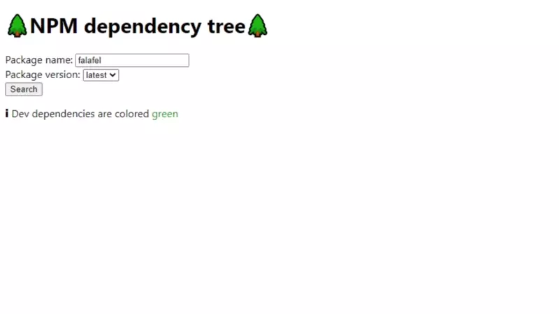

# 🌲NPM Dependency tree🌲
Watch a live version on my website:  
https://npm.xmb.li



## Features
- ⚡ Lightning fast caching with redis
- 🌲 Show dev dependencies and normal dependencies in a tree structure, information is fetched asynchronously from the API
- 💧 Select valid versions from a dropdown

## Technologies used
- Typescript
- Redis
- NodeJS
- ExpressJS webserver
- overnightjs for annotations
- Docker for Redis and deployment
## REST API
Types:
```ts
interface Dependency {
    name: string;
    version: string;
}

interface PackageDependencies {
    dependencies: Dependency[];
    devDependencies: Dependency[];
}
```
API:
```bash
# Return all dependencies of given package <package_name> with <version>
/api/dependencies/<package_name>/<version>
returns PackageDependencies

# Return all valid versions of given package <package_name>
/api/versions/<package_name>
returns string[]
```

## Excercise Requirements
1. Create a working application that, given the name of a published npm package, returns
the entire set of dependencies for the package.
2. Present the dependencies in a tree view.
3. We require tests. It’s up to you what style and how exhaustive these are.
4. Account for asynchronous fetching of dependencies as you see fit.
5. Consider caching relevant data so that repeated requests resolve with minimum latency.

## Pre project considerations
### Caching
Options:
- Redis, or other in-memory caches
- In-Memory, fast easy, clears when server dies
    - Create db with dependencies, update if version changes -> also update all dependencies

### Dependency tree
Tree will only be built in frontend, api provides packageName -> dependency list
### Security
Should have some basic validation on package name/version, to not pass it directly to npmjs

### Testing
I opted for mostly integration tests, as the API is the best way to test the functionality directly. It actually spins up the same express server to run the tests on.

### Versions
- Versions will always evaluate to their maximum viable version, it does this by querying all available versions for a package and then chooses the maximum with the node-semver package
- Versions like "*" will evaluate to "latest"

## Installation

Requirements:
- Node 15+ (untested for older versions)
- Docker
- Docker-compose

```bash
# Clone repo
git clone https://github.com/mbharanya/NPM-Dependency-Tree
cd NPM-Dependency-Tree
# install dependencies
npm install
# start redis server
docker-compose up -d redis
```

## Building
```bash
# start typescript compilation in watch mode
npm build:watch
# start nodemon to watch for changes and redeploy server if changes are detected
npm dev
```

## Running tests
```bash
# make sure the redis server is running and you have access to https://npmjs.org
npm test
```
## Deploying, running
Use `docker-compose.yml` to deploy it.
Run
```bash
docker-compose up
```


## Post Project Thoughts
- It may be necessary to implement some kind of throttling for the requests sent to npmjs.org, otherwise we could risk being rate limited
- Redis could also use persistent storage
- The validation for package names is quite strict, as I'm using the official requirements for package names. So queries for node packages like 'buffer' will be blocked as well
- Scalability: 
    - As the API calls are stateless, it would be possible to convert them to run on AWS lambda or other serverless platforms. The only state saved is the cache in Redis, multiple instances could be spun up in different locations

## Acknowledgements
Basic setup by:
https://levelup.gitconnected.com/setup-express-with-typescript-in-3-easy-steps-484772062e01